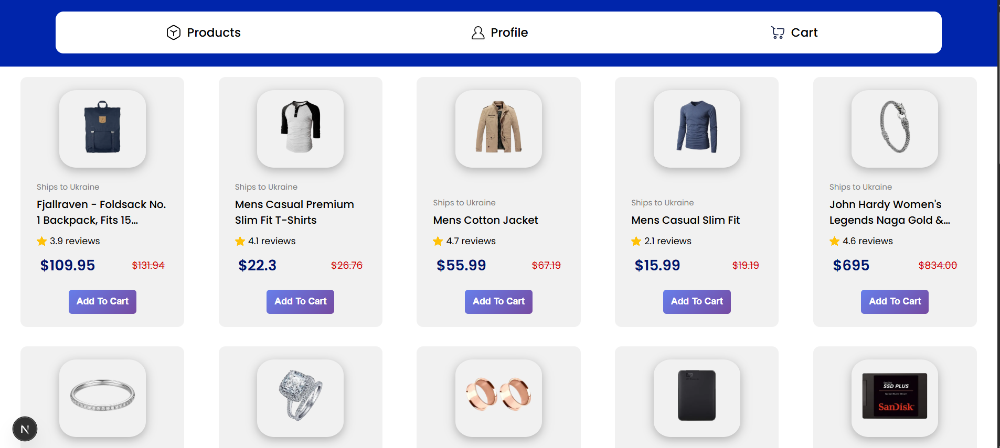
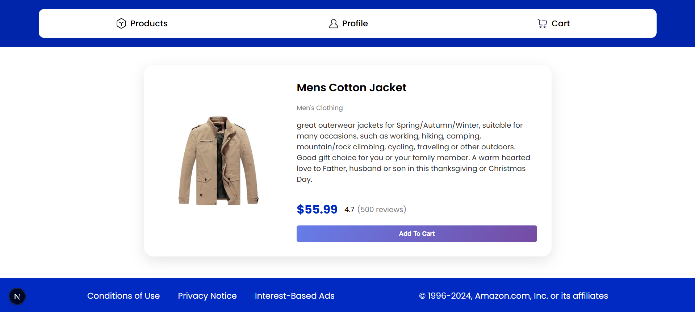
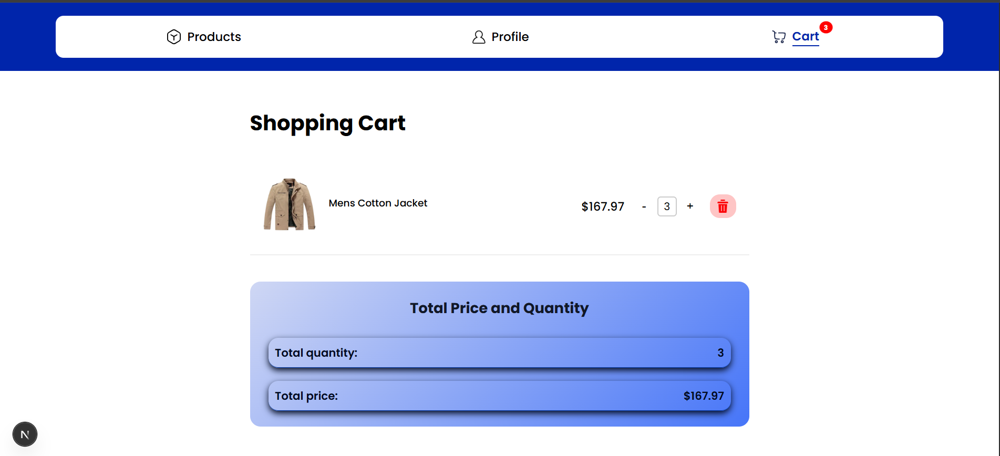
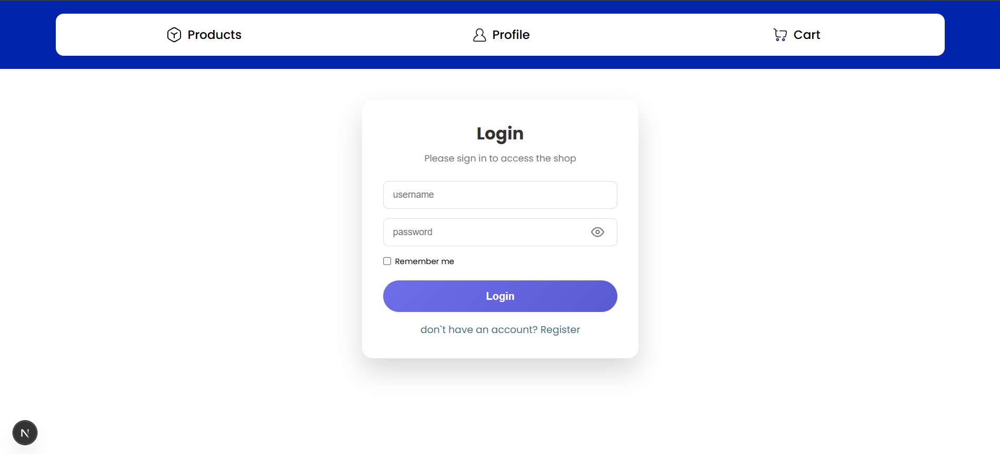
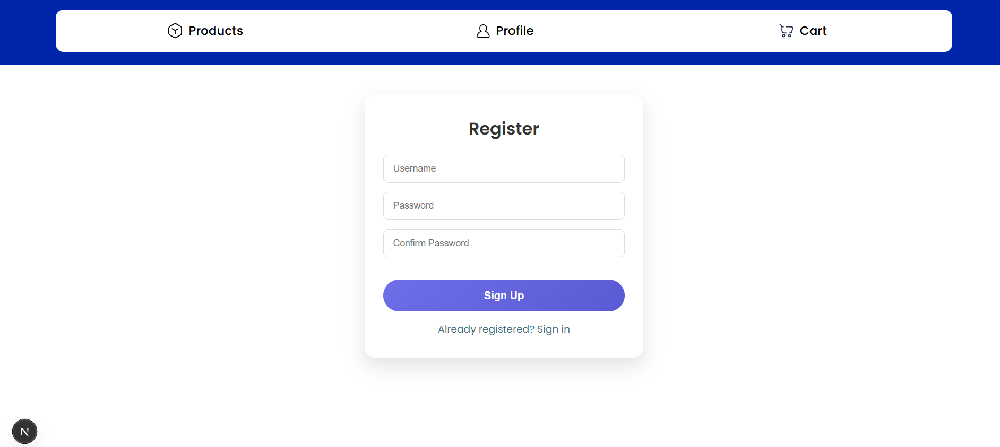
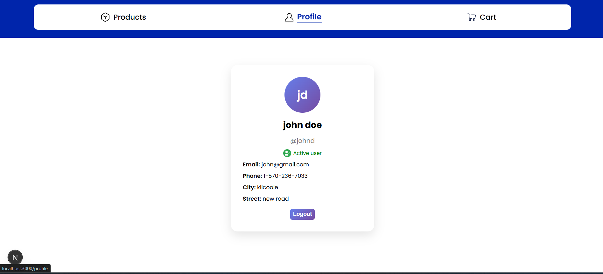

# React / Next.js E-commerce Project

This is an e-commerce web application built using **Next.js** and **React**.
The app allows users to browse products, view product details, and manage a shopping cart.
Access to the cart page is restricted to authenticated users only.

---

## Screenshots

### Home Page



### Product Details Page



### Cart Page



### Login Page



### Register Page



### Profile Page



## Features

- User authentication (Login / Register)
- Form validation using **react-hook-form** and **yup**
- Product list fetched from FakeStore API
- Dynamic product details pages
- Shopping cart functionality using **Redux Toolkit**
- Increase, decrease, and remove products from cart
- Cart total quantity and total price calculation
- Profile page with user information
- Deployed on **Vercel**

## Live Demo

https://react-final-mocha-psi.vercel.app/

## GitHub Repository

https://github.com/mariamibali/react-midterm

---

## Technologies Used

- Next.js (App Router)
- React
- Redux Toolkit
- React Hook Form
- Yup
- CSS Modules
- FakeStore API

---

## Project Structure

````txt
src/
├── app/
│   ├── (auth)/
│   │   ├── login/
│   │   └── register/
│   ├── cart/
│   ├── product/
│   │   └── details/[id]/
│   ├── profile/
│   ├── layout.js
│   ├── page.js
│   └── globals.css
│
├── components/
│   ├── button/
│   ├── navbar/
│   └── footer/
│
├── lib/
│   ├── slices/
│   │   ├── cartSlice.js
│   │   └── userSlice.js
│   ├── hook.js
│   └── store.js

## ⚙️ Installation & Run

Clone the repository and run the project locally:

```bash
npm install
npm run dev
````
